# bangalore-hotel-data-analysis
R data analysis project ranking Bangalore hotels by value using hotel scoring, visualizations, t-tests, regression, and ANOVA.

## Goal
Main goal of this project is to determine which hotels in Bangalore India is the best overall value based on guest rating, review count, price, distance from the city center and room size.

## Motivation 
I love traveling and I been to 21 countries plus cool places like Guam and Puerto Rico. Travelers usually care about more than just price.  A good hotel should have good balance between cost, location, reviews, roomsize and overall quality. This project creates a hotel scoring system to compare hotels more systematically. 

## Dataset
The dataset used in this proejct was the Bangalore Hotel Booking Dataset (2026) from Kaggle. 
Dataset link: https://www.kaggle.com/datasets/samhoon/bangalore-hotel-booking-dataset-2026
The dataset contains 500 hotel listings from Bangalore, India. 

## Variables
hotel_name
area
star_rating
room_type 
price_per_night_inr
guest_rating
review_count
room_size_sqft
distance_from_city

## Dervied Variables## Derived Variables

To compare hotels more fairly, I created several derived variables from the original dataset. These variables helped standardize different hotel features and build an overall hotel value score.

### Normalized Factor Scores

Because the variables were measured on different scales, I converted them into normalized scores between 0 and 1.

- `rating_score`: normalized version of `guest_rating`
- `review_score`: normalized log-transformed version of `review_count`
- `room_size_score`: normalized version of `room_size_sqft`
- `price_score`: normalized price score where lower prices receive higher scores
- `distance_score`: normalized distance score where hotels closer to the city center receive higher scores

```r
rating_score = guest_rating / max(guest_rating, na.rm = TRUE)

review_score = log(review_count + 1) / max(log(review_count + 1), na.rm = TRUE)

room_size_score = room_size_sqft / max(room_size_sqft, na.rm = TRUE)

price_score = 1 - (price_per_night_inr / max(price_per_night_inr, na.rm = TRUE))

distance_score = 1 - (distance_from_city_center_km / max(distance_from_city_center_km, na.rm = TRUE))
```

### Hotel Score

I created an overall `hotel_score` by giving equal weight to five factors: guest rating, review count, price, distance from the city center, and room size.

```r
hotel_score =
  0.20 * rating_score +
  0.20 * review_score +
  0.20 * price_score +
  0.20 * distance_score +
  0.20 * room_size_score
```

A higher `hotel_score` means the hotel has a stronger overall balance of high guest ratings, many reviews, lower price, larger room size, and closer distance to the city center.

### Hotel Score Group

I created `top_20_group` to separate the 20 hotels with the highest hotel scores from the rest of the dataset.

- `Best 20 Hotel Score`
- `Out of Top 20`

This allowed me to compare the highest-ranked hotels against all other hotels.

### Price Group

I created `price_groups` by comparing each hotel’s price per night to the median price.

- `Cheap Hotel`: hotels at or below the median price
- `Expensive Hotel`: hotels above the median price

This allowed me to compare cheap and expensive hotels using boxplots and Welch two-sample t-tests.

## Research Questions
1. Which hotels in Bangalore provide the best overall value?
2. Do cheap and expensive hotels differ in guest rating, room size, distance, star rating, and price?
3. Do the top 20 hotel-score hotels differ from the rest of the hotels?
4. Which variable best predicts hotel price per night?
5. Is star rating significantly related to price per night?

## Methods
All analysis was conducted in R using `tidyverse`, `dplyr`, `ggplot2`, `janitor`, `broom`, and base R statistical functions.

The analysis used:
- Data cleaning and variable name standardization
- Derived variable creation
- Hotel value score construction
- Exploratory data visualization
- Boxplots for group comparisons
- Two-sample t-tests
- Simple linear regression
- Multiple linear regression
- Adjusted R-squared model comparison
- ANOVA

## Statistical Analysis

### Welch Two-Sample T-Tests

I used Welch two-sample t-tests to compare the means of different hotel groups. Welch two-sample t-tests were appropriate because the comparisons involved two independent groups, such as cheap vs. expensive hotels or Best 20 Hotel Score hotels vs. hotels outside the top 20. The tests helped determine whether the differences seen in the boxplots were statistically significant.

The main grouping variables were:

- `price_groups`: compares `Cheap Hotel` and `Expensive Hotel`
- `top_20_group`: compares `Best 20 Hotel Score` and `Out of Top 20`

The t-tests compared group means for guest rating, room size, distance from the city center, star rating, and price per night.

### T-Test Results Summary

| Test | P-value | 95% Confidence Interval | Result |
|---|---:|---:|---|
| Guest rating by price group | 0.5619 | (-0.0677, 0.1245) | Not statistically significant |
| Guest rating by hotel-score group | 1.871e-11 | (0.5898, 0.8544) | Statistically significant |
| Room size by price group | 0.592 | (-30.4843, 17.4123) | Not statistically significant |
| Room size by hotel-score group | 0.05069 | (-0.1872, 113.8455) | Not statistically significant at the 5% level |
| Distance from city center by price group | 0.04363 | (0.0328, 2.2516) | Statistically significant |
| Distance from city center by hotel-score group | 0.0002556 | (-5.9871, -2.1049) | Statistically significant |
| Star rating by price group | < 2.2e-16 | (-1.4536, -1.2904) | Statistically significant |
| Star rating by hotel-score group | 2.645e-06 | (-0.9474, -0.4693) | Statistically significant |
| Price per night by price group | < 2.2e-16 | (-11239.257, -9782.463) | Statistically significant |
| Price per night by hotel-score group | 5.184e-15 | (-6634.920, -4618.621) | Statistically significant |

### Interpretation of T-Test Results

The t-test results showed that cheap and expensive hotels did not have a statistically significant difference in average guest rating or average room size. This means that, in Bangalore India, cheaper hotels were not necessarily rated lower by guests and did not have significantly smaller rooms than expensive hotels.

However, cheap and expensive hotels did show statistically significant differences in distance from the city center, star rating, and price per night. Cheap hotels were farther from the city center on average, had lower star ratings, and had lower prices per night than expensive hotels.

The comparison between the Best 20 Hotel Score group and the hotels outside the top 20 showed stronger differences. The Best 20 Hotel Score group had significantly higher guest ratings, significantly lower prices, and was significantly closer to the city center. These results suggest that the top-ranked hotels were not simply the most expensive hotels. Instead, they provided stronger overall value by balancing high guest ratings, lower prices, and better location.

The Best 20 Hotel Score group did not have a statistically significant difference in room size at the 5% level. Although the top 20 hotels had a larger average room size, the p-value was slightly greater than 0.05, so there was not enough evidence to conclude that the difference in room size was statistically significant.

One important limitation is that some of these results should be interpreted carefully because the `hotel_score` was created using guest rating, review count, price, distance, and room size. Therefore, comparisons involving the Best 20 Hotel Score group may partly reflect how the score was constructed.

## Visualizations

### Guest Rating: Top 20 Hotels vs. Other Hotels

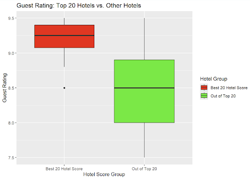

This boxplot compares guest ratings between the Best 20 Hotel Score group and the hotels outside the top 20. The Best 20 Hotel Score group has a higher average guest rating, showing that the top-ranked hotels generally received stronger guest reviews.

### Guest Rating: Cheap vs. Expensive Hotels

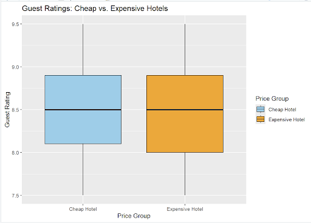

This boxplot compares guest ratings between cheap and expensive hotels. The two groups have very similar guest rating distributions, suggesting that cheaper hotels were not necessarily rated lower by guests.

### Room Size: Top 20 Hotels vs. Other Hotels

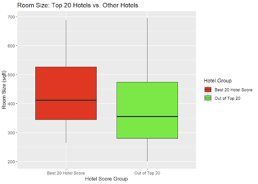

This boxplot compares room size between the Best 20 Hotel Score group and the hotels outside the top 20. The top 20 hotels appear to have slightly larger rooms on average, but there is still a lot of overlap between the two groups.

### Room Size: Cheap vs. Expensive Hotels

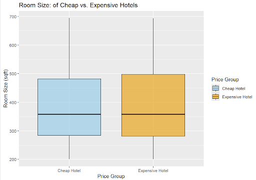

This boxplot compares room size between cheap and expensive hotels. The distributions are very similar, which suggests that expensive hotels did not have much larger rooms on average than cheap hotels in this dataset.

### Distance From City Center: Top 20 Hotels vs. Other Hotels

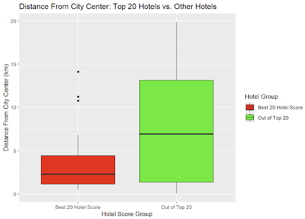

This boxplot compares the distance from the city center between the Best 20 Hotel Score group and the hotels outside the top 20. The Best 20 Hotel Score group is generally closer to the city center, suggesting that location was an important factor in overall hotel value.

### Distance From City Center: Cheap vs. Expensive Hotels

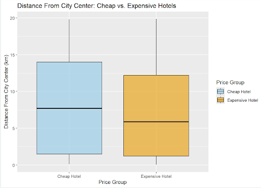

This boxplot compares the distance from the city center between cheap and expensive hotels. Cheap hotels tend to be slightly farther from the city center on average than expensive hotels.

### Star Rating: Top 20 Hotels vs. Other Hotels

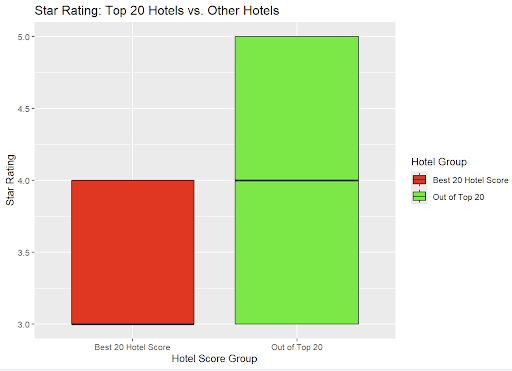

This boxplot compares star ratings between the Best 20 Hotel Score group and the hotels outside the top 20. The hotels outside the top 20 have higher star ratings on average, showing that the best-value hotels were not always the highest-star hotels.

### Star Rating: Cheap vs. Expensive Hotels

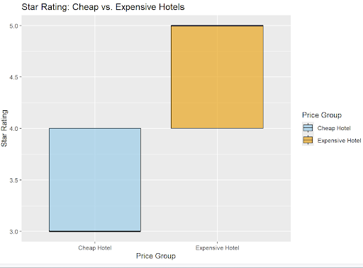

This boxplot compares star ratings between cheap and expensive hotels. Expensive hotels have noticeably higher star ratings than cheap hotels, which shows that star rating is strongly connected to hotel price.

### Price per Night: Top 20 Hotels vs. Other Hotels

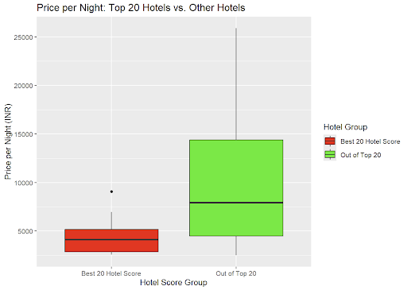

This boxplot compares price per night between the Best 20 Hotel Score group and the hotels outside the top 20. The Best 20 Hotel Score group has lower prices on average, suggesting that the top-ranked hotels offered better value rather than simply being the most expensive hotels.

### Price per Night: Cheap vs. Expensive Hotels

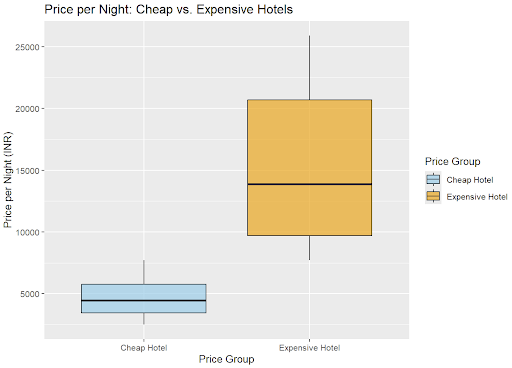

This boxplot compares price per night between cheap and expensive hotels. Expensive hotels have much higher prices, which is expected because the price groups were created using the `price_per_night_inr` variable.

### Relationship Between Star Rating and Price per Night

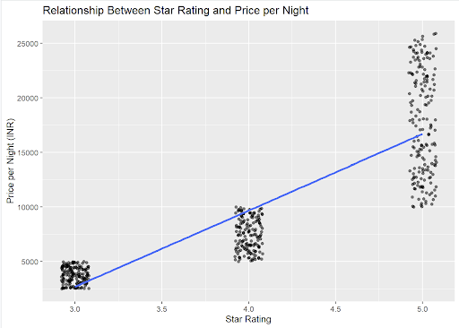

This scatterplot shows the relationship between star rating and price per night. The upward trend line shows that hotels with higher star ratings tend to have higher prices. This supports the regression and ANOVA results, which showed that star rating was the strongest predictor of hotel price in this dataset.

## Regression Analysis

To identify which hotel feature best predicted `price_per_night_inr`, I created several linear regression models and compared their adjusted R-squared values. Adjusted R-squared was used because it accounts for the number of predictors in the model and helps compare models more fairly.

### Models Tested

| Model | Predictors | Adjusted R-squared |
|---|---|---:|
| Model 1 | Guest rating, star rating, room size, distance from city center | 0.7496 |
| Model 2 | Guest rating only | -0.0003 |
| Model 3 | Star rating only | 0.7495 |
| Model 4 | Room size only | -0.0020 |
| Model 5 | Distance from city center only | 0.0023 |

### Regression Results

The full regression model, which included guest rating, star rating, room size, and distance from the city center, had an adjusted R-squared of **0.7496**. This means the model explained about **74.96%** of the variation in hotel price per night.

However, the model using only `star_rating` had an adjusted R-squared of **0.7495**, which was almost the same as the full model. This shows that star rating alone explained about **74.95%** of the variation in hotel price per night.

The models using only guest rating, room size, or distance from the city center had adjusted R-squared values close to zero or negative. This means those variables did not explain much variation in hotel price when used by themselves.

Overall, the regression analysis showed that **star rating was the strongest predictor of hotel price per night** in this dataset.

## ANOVA Test

I also used an ANOVA test to determine whether `star_rating` was significantly related to `price_per_night_inr`. This test helped confirm whether hotel price changes significantly as star rating increases.

```r
m6 <- lm(price_per_night_inr ~ star_rating, data = hotels)
anova(m6)
```

### Hypotheses

- **Null hypothesis:** Star rating does not explain a significant amount of variation in hotel price per night.
- **Alternative hypothesis:** Star rating does explain a significant amount of variation in hotel price per night.

### ANOVA Results

| Test | F-value | P-value | Result |
|---|---:|---:|---|
| Star rating predicting price per night | 1491 | < 2.2e-16 | Statistically significant |

The ANOVA test produced an F-value of **1491** and a p-value of **less than 2.2e-16**. Since the p-value is much smaller than 0.05, I reject the null hypothesis. This means there is strong evidence that star rating is significantly related to hotel price per night.

This result supports the regression analysis. The regression model using only `star_rating` had an adjusted R-squared of **0.7495**, meaning star rating alone explained about **74.95%** of the variation in price per night. Overall, hotels with higher star ratings tended to have higher prices in this dataset.

## Key Findings

The analysis showed that the best-value hotels were not always the most expensive or the highest-star hotels. Instead, the strongest hotels balanced guest rating, review count, price, room size, and distance from the city center.

Main findings:

- Cheap and expensive hotels did not have a statistically significant difference in average guest rating.
- Cheap and expensive hotels did not have a statistically significant difference in average room size.
- Cheap and expensive hotels did have statistically significant differences in distance from the city center, star rating, and price per night.
- The Best 20 Hotel Score group had significantly higher guest ratings than hotels outside the top 20.
- The Best 20 Hotel Score group had significantly lower prices and was significantly closer to the city center.
- The Best 20 Hotel Score group did not have a statistically significant difference in room size at the 5% level.
- Regression analysis showed that star rating was the strongest predictor of hotel price.
- Star rating alone explained about 74.95% of the variation in price per night.
- The ANOVA test also showed that star rating was significantly related to price per night.

## Best Hotels Identified

Based on the hotel scoring system, the best overall hotel was **Elite MG Road Heights**. This hotel had the strongest overall balance of guest rating, review count, price, room size, and distance from the city center.

Other strong hotels included:

1. **Elite MG Road Heights** — Best overall hotel
2. **Royal Rajajinagar Retreat** — One of the highest guest-rated hotels
3. **Emerald MG Road Suites** — Best room size among the top 20 hotels
4. **Skyline MG Road Lodge** — Strong value based on price and location
5. **Elite MG Road Stay** — Best cost-effective hotel in the top 20 group

### Category Winners

| Category | Hotel | Reason |
|---|---|---|
| Best overall hotel | Elite MG Road Heights | Highest overall hotel score |
| Best cost-effective hotel | Elite MG Road Stay | Lowest price among the top 20 hotels and only 0.99 km from the city center |
| Best room size | Emerald MG Road Suites | Largest room size among the top 20 hotels at 688 sqft |
| Best guest rating | Elite MG Road Heights and Royal Rajajinagar Retreat | Both had guest ratings of 9.5 |

## Conclusion

This project used statistical methods to determine which hotels in Bangalore, India provide the best overall value. First, I cleaned the dataset and created normalized scores for guest rating, review count, room size, price, and distance from the city center. I then combined these five variables into an equal-weighted hotel score to rank the hotels and separate the Best 20 Hotel Score group from the rest of the dataset.

I also created price groups to compare cheap and expensive hotels. Boxplots were used to visually compare differences between groups, and Welch two-sample t-tests were used to determine whether those differences were statistically significant. The t-tests showed that cheap and expensive hotels did not have significant differences in average guest rating or room size, but they did differ significantly in distance from the city center, star rating, and price per night.

The Best 20 Hotel Score group had significantly higher guest ratings, lower prices, and shorter distance from the city center compared to hotels outside the top 20. However, the Best 20 Hotel Score group did not have a statistically significant difference in room size at the 5% level.

I also used regression models to determine which variable best predicted hotel price per night. The full regression model explained about 74.96% of the variation in price, but star rating alone explained about 74.95%. This suggests that star rating was the strongest predictor of hotel price in this dataset. The ANOVA test supported this result because it showed that star rating was significantly related to price per night.

Overall, the results suggest that the best hotels were not simply the most expensive or highest-star hotels. Instead, the best-value hotels were the ones that balanced strong guest ratings, many reviews, reasonable prices, good room size, and convenient distance from the city center.

## Limitations

One limitation of this project is that the hotel score was created using selected variables and equal weights. A different scoring system or different weights could produce a different ranking.

Another limitation is that some comparisons involving the Best 20 Hotel Score group should be interpreted carefully because the same variables used in the t-tests were also used to create the hotel score.

Therefore, the results should be interpreted as patterns within this dataset and scoring system rather than as a definitive ranking of all real hotels in Bangalore, India.

## How to Run This Project

1. Download the dataset.
2. Open `bangalore_hotel_analysis.Rmd` in RStudio.
3. Install the required R packages.
4. Run the R Markdown file to reproduce the analysis.

```r
install.packages(c("tidyverse", "janitor", "ggplot2", "broom"))
```

After installing the packages, load them in R:

```r
library(tidyverse)
library(janitor)
library(ggplot2)
library(broom)
```

Make sure the dataset is saved in the `data/` folder. The file path in the R Markdown should look like this:

```r
hotels <- read_csv("data/Bangalore Hotel Booking Dataset (2026).csv") |>
  clean_names()
```

## Files in This Repository

```text
README.md
bangalore_hotel_analysis.Rmd
bangalore_hotel_analysis.html
Bangalore_Hotel_Visualizations.pdf
data/
Figures/
```

### File Descriptions

| File or Folder | Description |
|---|---|
| `Figures/` | Folder containing exported graphs used in the README |
| `data/bangalore_hotel_booking_dataset_2026.csv` | Dataset used for the hotel analysis |
| `Bangalore_Hotel_Visualizations.pdf` | PDF containing the main project visualizations |
| `README.md` | Main project summary and explanation |
| `bangalore_hotel_analysis.Rmd` | Full R Markdown file with code, visualizations, and statistical analysis |
| `bangalore_hotel_analysis.html` | Rendered HTML version of the R Markdown report |
